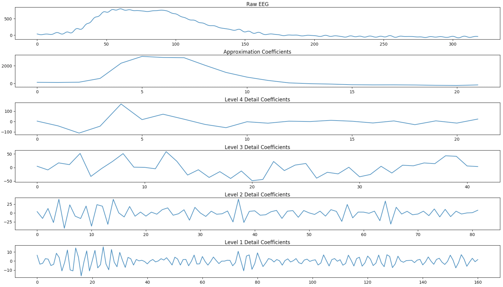

A 4-level wavelet decomposition using Daubechies order-2 (db2) mother wavelet is performed on all 14 channels of the chunk of EEG data.

One advantage of wavelet analysis over other time-frequency distribution methods (e.g. STFT) is that wavelet analysis varies the time-frequency aspect ratio, producing good frequency localization at low frequencies (long time windows), and good time localization at high frequencies (short time windows). This results in a segmentation of the time-frequency plane that will reveal transient features of the signal, which are typically not obvious during Fourier analysis.

Following the wavelet decomposition, the first four statistical moments (mean, variance, skewness, kurtosis) are calculated for each wavelet vector. Since four moments are calculated for each of the 5 wavelet decomposition vector per EEG channel, a total of 14 x 4 x 5 (280) features are calculated. These features are used as an input for the classification models.
