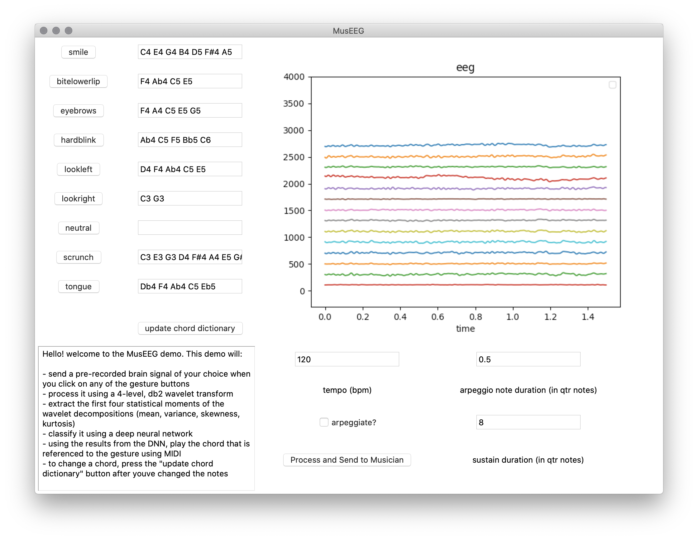

The MusEEG demo application provides an example of the basic functionality of the package.

##### the gesture buttons and chord dictionary
The top left corner allows you to load a random sample from the existing facial gesture dataset by pressing on one of the facial gesture buttons. Once loaded, the 14-channel raw EEG signal will be plotted in the plot box.

Next to each facial gesture button is a text entry field that allows you to define the set of notes that will be played when the facial gesture is sent to the main processor. Note: whenever the user changes notes in the chord dictionary, the `update chord dictionary` button must be pressed in order for the changes to take effect.

##### process and send to musician button
The `process and send to musician` button performs the following actions:
1. wavelet transform of raw eeg signal
2. statistical moment calculations of wavelet decomposition signals
3. creates DNN input array from extracted stat moments
4. the DNN classifies the signal into either of the available gestures
5. the gesture is referred to its matching chord in the chord dictionary, and a `chord` object is created from the matching chord
6. the `playchord` method is called on the `chord` object, sending a midi message according to the additional control parameters

##### additional controls
Additional controls are available for the demo app:
- arpeggiate: if the box is checked, the chord will play in an arpeggio as opposed to vertically.
- sustain duration: indicates how long (in quarter notes) the chord will be sustained (only applied if `arpeggiate` is unchecked)
- arpeggio note duration: indicates how long (in quarter notes) each note in the arpeggio will last.

to run the demo application, run `demoApp.py` from the [github](https://github.com/hugofloresgarcia/MusEEG) repository.
